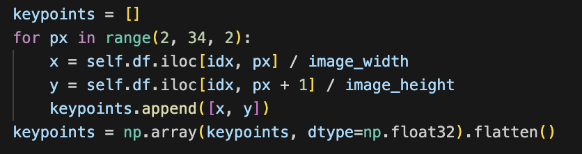

## Project: Human Posture and Skeleton Recognition Using Computer Vision

### Setup

Basic setup:
Using **final_model_0609.ipynb**
```
pip install pandas numpy matplotlib pillow tqdm torch scikit-learn torchvision
```

### Overview

Human posture and skeleton recognition using computer vision is a rapidly advancing field that integrates computer vision and machine learning to identify and analyze human body positions and movements. This technology is essential for various applications such as healthcare, sports, entertainment, ergonomics, and security. It helps monitor patients, enhance athletic performance, create realistic animations, improve workplace setups, and boost surveillance and safety measures.

### Dataset

For this project, we utilize the MPII Human Pose dataset, a publicly available dataset containing over 25,000 images annotated with detailed human pose key points. This dataset is ideal for training and testing supervised learning models for human pose recognition and analysis. You can download the dataset from [MPII Human Pose](http://human-pose.mpi-inf.mpg.de/). Once downloaded, place the images in the `MPII/Images` directory.

### Model Architecture

Our model, named **ComplexNet**, is a deep Convolutional Neural Network (CNN) designed to accurately identify key points in an image for human skeleton detection. The architecture includes:

- **Convolutional Layers:** Five layers with increasing feature maps (64, 128, 256, 512) to capture detailed and complex features.
- **Batch Normalization:** Applied after each convolutional layer to stabilize and speed up training.
- **Activation and Pooling:** Each convolutional layer is followed by ReLU activation and max pooling to highlight important features.
- **Fully Connected Layers:** Three layers transforming the data to 2048, 1024, and 32-dimensional spaces, representing key points.
- **Optimization:** The model uses the Mean Squared Error (MSE) loss function and Adam optimizer, running on a GPU for efficiency.

### Training and Performance

**The important method that lower the MSE!**
During training, the model initially had a loss of 0.065, which decreased to 0.045 after 25 epochs, indicating a 30% reduction. The loss curve showed rapid learning in the early epochs, stabilizing around the 15th epoch. The final test MSE was 0.043666, close to the training loss, suggesting good generalization and no significant overfitting.

### Instructions

1. **Download the Dataset:** Obtain the MPII Human Pose dataset from [here](http://human-pose.mpi-inf.mpg.de/).
2. **Directory Structure:** Place the dataset in the `MPII/Images` directory.

### Conclusion

Our project aims to improve real-time human posture detection, potentially contributing valuable insights and advancements to the field of computer vision and machine learning.

### Citation
@inproceedings{andriluka14cvpr,
               author = {Mykhaylo Andriluka and Leonid Pishchulin and Peter Gehler and Schiele, Bernt}
               title = {2D Human Pose Estimation: New Benchmark and State of the Art Analysis},
               booktitle = {IEEE Conference on Computer Vision and Pattern Recognition (CVPR)},
               year = {2014},
               month = {June}
}